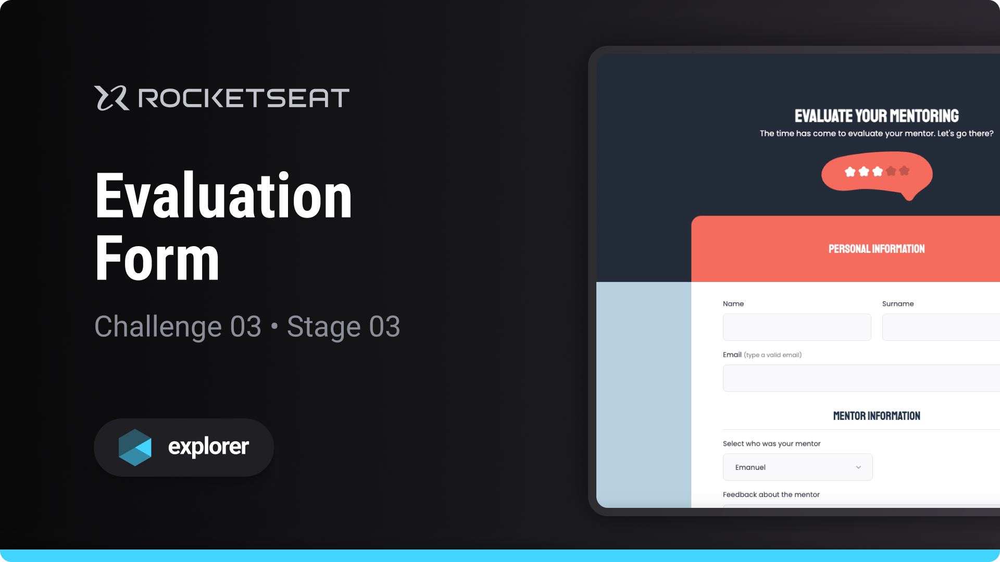

# Evaluation Form

Challenge developed on Rocketseat's Explorer course

**Evaluation Form is a form page designed to put into practice the basic concepts of web development**

## 🔗 Project Links

- 🚀 [**Deploy**](https://emanueltavecia.github.io/evaluation-form)
- 🎨 [**Figma**](https://www.figma.com/file/fnZyJHs7eqNFAA7tUrKcsD/Stage-03---Formul%C3%A1rio-avan%C3%A7ado/duplicate)

## 📋 Project information

- Rocketseat Explorer
- Stage 03
- Challenge 03

## 🧠 Concepts learned

The development of this challenge aims to put the following concepts into practice:

- Basic structure of an HTML page
- More HTML tags
  - form, fieldset, legend, input, label, textarea, select
- Basic CSS styling
  - ::before, ::after, ::invalid, flex, appearance, background, position

## 💻 Technologies

## 📄 License

This project is licensed under the MIT License - see the [LICENSE](./LICENSE) file for more details.
